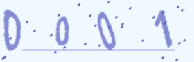

# 基于深度学习的验证码识别系统

> 本项目注意事项

本项目结构独立性较强，主要由 **验证码降噪分割算法** 和 **图像分类神经网络结构** 两部分组成，可以仅查看其中的一部分

验证码降噪算法的目的是将一张带有数个字符的图片分割为独立的字符，以便识别

图像分类网络会使用Pytorch复现各种架构，包括但不限于`AlexNet | VGG | NiN`

 

## 验证码类别

- [x] 分离数字验证码

验证码参数: Width-280 | Height-90

降噪算法: **灰度峰值滤波**

分割算法: **列扫描断点分割**

训练集: 2500张  (2500 x 4 理论1w)

测试集: 7000+张

网络架构: 网络架构会做出一些修改，以更符合该任务。灰度图会repeat至3个通道

|                 网络架构                  |             训练轮次-Epoch              |               准确率-Accuracy               |                             备注                             |
| :---------------------------------------: | :-------------------------------------: | :-----------------------------------------: | :----------------------------------------------------------: |
|                 CustomNet                 |                   100                   |                   0.86112                   |                          自定义网络                          |
|                  AlexNet                  |                   50                    |                   0.89926                   |                           参数微调                           |
| VGG16 | 50  | 0.00013 |      FC层4096->1024      |
|                   VGG16                   |                   100                   |                   0.89680                   |               FC层4096->1024，58E Loss开始下降               |
|  NiN  | 50  | 0.00000 | 输出层使用自适应平均池化 |
|  NiN  | 100 | 0.00013 | 输出层使用自适应平均池化 |
|                    NiN                    |                   50                    |                   0.89516                   |                      输出层使用全连接层                      |

 

 

- [ ] 贴合数字验证码

 

 

- [ ] 紧凑数字字母验证码

 

 

- [ ] 会赢吗? 会赢的。

